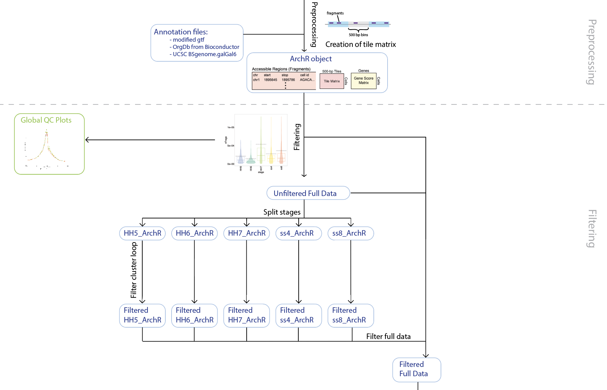
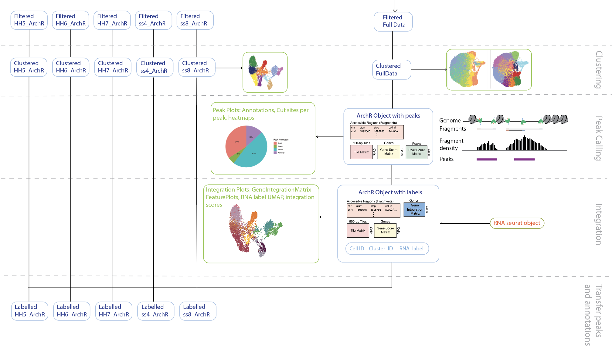
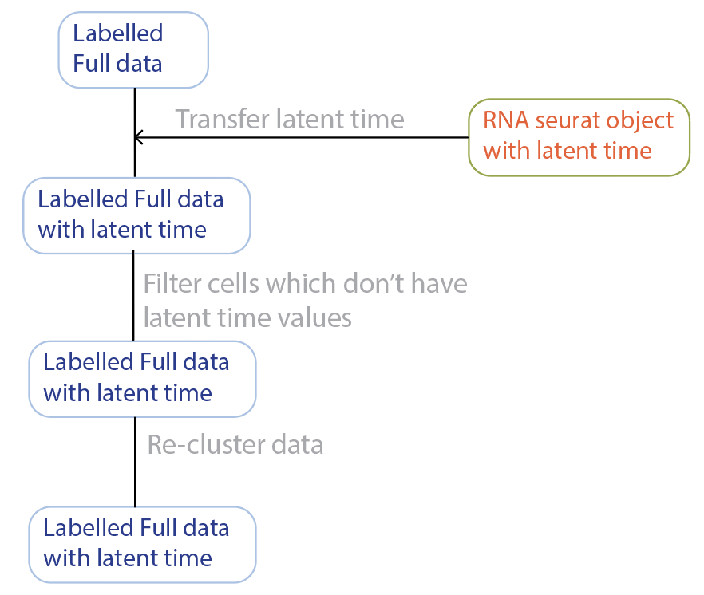

# NF-downstream_analysis

This folder contains all the code used to perform downstream analysis of scATAC-seq data and scRNA-seq data collected from the chick ectoderm in this project. This code is organised into a custom Nextflow pipeline. Different parts of the pipeline utilise different packages, including: the R packages ArchR (for scATAC-seq analysis), Seurat (for scRNA-seq analysis), Antler (for peak/gene module analysis) and scMEGA (for GRN inference) and the Python package SEACells (for metacell analysis). 

As the pipeline is long, it is divided into sections which can be run independently of each other using switches. These sections are:

* Upstream Processing - creates an ArchR object from aligned scATAC-seq data and filters poor quality cells
* Single Cell Processing - clusters scATAC-seq data, performs peak calling, integrates with scRNA-seq data and performs additional data preparation steps for scMEGA processing
* scMEGA Processing - integrates scATAC-seq and scRNA-seq data and runs scMEGA GRN inference
* Metacell Processing - summarises scATAC-seq and scRNA-seq data as metacells, integrates them and identifies peak modules
* Multiview Processing - visualises metacell assignments on single cells, visualise peak module dynamics, motif analysis

## Upstream Processing ('upstream_processing')
This part of the pipeline must be run before any other analysis. This section creates the ArchR object which allows for easy manipulation of scATAC-seq data, and performs important quality control and filtering steps on this data. 

First, the Cellranger output is combined with the reference genome annotation file (.gtf) and this data is fed into the process PREPROCESSING which runs the R module using the R script [ArchR_preprocessing.R](https://github.com/evaham1/atac_neural_plate_border/blob/main/NF-downstream_analysis/bin/ArchR_preprocessing/ArchR_preprocessing.R). This script builds gene and genome annotations from the UCSC galGal6 genome and the inputted gtf file. It then reads in three cellranger outputs: filtered peak matrix, cell IDs and fragments, and converts them into Arrow files and an ArchR project. These steps (and the reference geome) can be modified, and they loosely follow the [ArchR tutorial](https://www.archrproject.com/bookdown/index.html).

Once the ArchR project has been made, it is passed to a custom Nextflow subworkflow called [FILTERING](https://github.com/evaham1/atac_neural_plate_border/blob/main/NF-downstream_analysis/subworkflows/local/UPSTREAM_PROCESSING/Filtering.nf). Subworkflows allow for pipeline abstraction and ease their organisation. 

1) Filtering full data for doublets
This subworkflow first filters out potential doublets by removing cells that have very high numbers of fragments. As the 5 samples used in the NPB project were sequenced to varying degrees, a sample-specific approach was taken and only cells that had more than 1SD above the mean number of fragments for that sample were removed. This is carried out by the process GLOBAL_FILTER which runs the custom R script [ArchR_global_filtering.R](https://github.com/evaham1/atac_neural_plate_border/blob/main/NF-downstream_analysis/bin/ArchR_preprocessing/ArchR_global_filtering.R). This R script uses ArchR to plot the distribution of fragment counts, nucleosome banding signal and transcription start site enrichment scores for each sample. In the NPB project, only fragment counts were used as a metric to filter cells, however the script can be edited to filter on other QC metrics and/or change the filtering thresholds. 

2) Filtering each sample for poor quality cells
As well as being doublets, cells can be poor quality or dying and therefore should be removed from downstream analysis. Rather than filtering cells using arbitrary thresholds, cells were clustered and then assessed for their distribution of the quality control metrics TSS enrichment and nucleosome banding. If a cluster showed an outlier pattern (i.e. outside the 20-80 percentile range of the clusters in that sample), it was removed. This was run iteratively until no outlier clusters remained. This filtering step was run on each sample individually, so first the process SPLIT_STAGES was run which uses the R script [ArchR_split_stages.R](https://github.com/evaham1/atac_neural_plate_border/blob/main/NF-downstream_analysis/bin/ArchR_utilities/ArchR_split_stages.R) to split the ArchR project by stage into individual ArchR projects. This uses the generic R function [ArchR_SplitbyStage](https://github.com/alexthiery/scHelper/blob/master/R/ArchR_SplitbyStage.R) which is part of the scHelper R package from the Streitlab group. Next, the individual stages were processed in parallel by the process FILTER_CLUSTER_LOOP which uses the R script [ArchR_cluster_filter_loop.R](https://github.com/evaham1/atac_neural_plate_border/blob/main/NF-downstream_analysis/bin/ArchR_preprocessing/ArchR_cluster_filter_loop.R) which can be modified. 

3) Combining filtering steps
Finally, the results of these two filtering steps are combined. The first filtering step was performed on the full dataset, whilst the first and second step was performed on the individual stages. Therefore the full data still needs to be filtered for the second filtering step. To do this, the output of the second filtering step is collected so all the samples are combined into one channel, and then they are fed into the process FILTER_FULL which runs the R script [ArchR_filter_full_data.R](https://github.com/evaham1/atac_neural_plate_border/blob/main/NF-downstream_analysis/bin/ArchR_preprocessing/ArchR_filter_full_data.R) which uses the cell IDs of the ArchR sample projects to filter the full dataset ArchR project. 

### Re-using the steps in this workflow
We believe that our filtering approach can separate poor quality and doublet cells from good datapoints as it 1) does not rely on arbitary quality metric thresholds, 2) accounts for sequencing depth differences between samples and 3) utilises the assumption that cells of a similar quality cluster together. Our Nextflow workflow can be reused either in whole, by simply changing the input data and genome, or in part by utilising the R scripts directly and adjusting them as required. 

## Single Cell Processing ('sc_processing')
This part of the pipeline processes the scATAC-seq data at a single cell level by clustering, calling peaks and integrating with scRNA-seq data. This section of the pipeline results in an ArchR object with the full data and an ArchR object for each sample (in the case of the NPB project, each sample corresponds to a developmental stage). All of these ArchR objects have the same peak information, cell state labels and integrated gene counts. Finally, the full dataset is further processed to add latent time information from scRNA-seq data so it can be used for network inference. 

First, the full dataset is clustered, peaks are called and the data is integrated with scRNA-seq data. All of these steps are performed using ArchR functions. In parallel, the sample dataset is also clustered so that they can be visualised by their invididual UMAP embeddings. Peak calling on just one sample would result in a different set of peaks than peak calling across the whole dataset. To ensure that all data objects have the same peak set and integration results, peak calling and integration was performed on the full dataset and then the resulting information was transferred onto the sample ArchR objects. 

At the end of this section of the pipeline, some additional processing steps are carried out on the full data object to prepare it for network inference using scMEGA. These steps involve transferring latent time information from scRNA-seq data onto the scATAC-seq data. As latent time values are not assigned to every cell in the dataset, the scATAC-seq data is then subsetted to only include cells in the latent time trajectory and re-clustered. 

### Re-using the steps in this workflow
Each step in this section of the pipeline runs a generic R script which can be re-used for other scATAC-seq analysis. [14 R scripts](https://github.com/evaham1/atac_neural_plate_border/tree/main/NF-downstream_analysis/bin/ArchR_utilities) have been created which run various steps of scATAC-seq analysis using the ArchR package. These scripts process the data by clustering, peak calling and integrating, but also create extra visualisations and QC checks using custom functions from the [scHelper package](https://github.com/alexthiery/scHelper). At the top of each R script are a list of script options which can be overwritten externally, either in a config file if running through a Nextflow pipeline or in the bash command if running the R script on the command line. As many arguments such as clustering resolution have been abstracted out in this way, these R scripts can be run for any analysis without modification. 

## scMEGA Processing (mega_processing)
